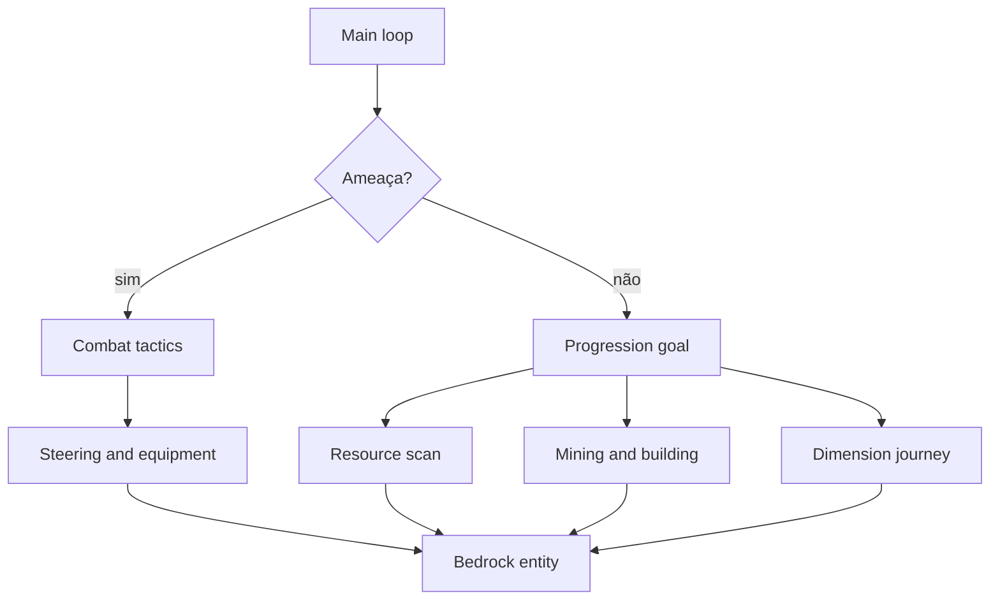
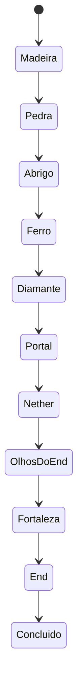

# Arquitetura

## Visão geral

O projeto combina comportamentos data-driven da Bedrock com um planejador JavaScript. A entidade nativa resolve física, animação básica, natação, portas, pickup e passeio ocioso. O script escolhe metas, procura recursos, movimenta o agente, altera inventário, executa crafting, mantém relações e controla a campanha.

## Módulos

| Arquivo | Responsabilidade |
| --- | --- |
| `main.js` | Eventos, loop escalonado, comandos, morte e respawn |
| `core/brain.js` | Funções puras de etapa, tática, relação e pontuação |
| `progression.js` | Campanha, mineração, crafting, construção e dimensões |
| `combat.js` | Seleção de alvo, strafe, kite, escudo, arco e loot |
| `social.js` | Confiança, equipes e interface touchscreen |
| `navigation.js` | Steering, obstáculos, perigos, desatolamento e busca local |
| `inventory.js` | Contagem, consumo, crafting, equipamento e snapshots |
| `config.js` | IDs, limites, listas de recursos e ajuste de dificuldade |
| `util.js` | Persistência, vetores, hashing e operações protegidas |

## Máquina de progressão

A transição só ocorre quando fatos observáveis estão satisfeitos. Por exemplo, “Ferro” exige picareta, espada e escudo no inventário; “Nether” exige portal construído e dimensão atual igual ao Nether.

## Orçamento de processamento

- máximo padrão de 16 agentes carregados;
- atualização principal a cada 5 ticks;
- agentes são escalonados quando há mais de quatro;
- busca de blocos limitada por `SCAN_BUDGET`;
- alvo de recurso e progresso de mineração ficam em cache;
- relações persistentes são limitadas às 24 mais relevantes.

O limite controla entidades carregadas, não apaga agentes persistidos em chunks descarregados.

## Navegação

A API expõe configuração do pathfinder interno, mas não fornece ao script uma chamada estável “ande até este Vector3”. O projeto usa um híbrido:

1. `minecraft:navigation.walk` trata locomoção natural, água, portas e salto.
2. O steering aplica impulsos pequenos na direção da meta.
3. Sondas nos pés, cabeça e próximo apoio detectam parede, lava e penhasco.
4. O agente salta, muda lateral ou minera o obstáculo.
5. Após várias amostras sem deslocamento, `tryTeleport` faz um desatolamento máximo de aproximadamente um bloco.

Isso evita a aparência de teleporte contínuo; o recurso é usado apenas como recuperação.

## Persistência e morte

Propriedades com prefixo `aip:` guardam a parte durável. Caches de alvo, mineração e steering ficam apenas em memória e podem ser reconstruídos. Na morte:

1. propriedades e inventário são serializados;
2. caches da entidade antiga são removidos;
3. após 100 ticks nasce uma nova entidade no Overworld;
4. o snapshot é restaurado e o contador de mortes aumenta.

## Decisões deliberadamente simuladas

Um add-on estável não tem acesso a todos os controles internos de um Player. Crafting, clique de escudo, localização de stronghold e travessia exclusiva de portal são reproduzidos por regras auditáveis. O código separa essas adaptações das ações nativas para que futuras versões da Script API possam substituí-las.
